<div align="center">

<a href="https://keploy-vanshikagupta-devrel-assignm.vercel.app/">
  
</a>

<br>

[](https://keploy-vanshikagupta-devrel-assignm.vercel.app/)


**A hands-on walkthrough of [Keploy](https://keploy.io)'s Go quickstart, with every error I hit and how I fixed it.**

[Live site](https://keploy-vanshikagupta-devrel-assignm.vercel.app/) &nbsp;·&nbsp; [What's inside](#-whats-on-the-page) &nbsp;·&nbsp; [Problems covered](#-problems-covered) &nbsp;·&nbsp; [Run it locally](#-run-it-locally)

</div>

---

## 👋 What this is

Keploy is an open-source tool that **writes API tests for you**. You run your app under Keploy, use it like a client would, and Keploy saves each API call as a test case and each database query as a mock. Later it replays those calls and tells you if any response changed.

This repository is the source of a **single-page tutorial** I built while learning it. I ran the **Echo + PostgreSQL URL shortener** sample on **Windows with WSL (Ubuntu)** and wrote down what actually happened: the commands, the exact errors, the causes and the fixes.

> It is an independent write-up of one quickstart, not official Keploy documentation.

## 🎬 The run, in 20 seconds

<div align="center">
  
</div>

## 🔁 How Keploy works

<div align="center">
  
</div>

For a Go developer the payoff is **regression tests without writing test code**. Nothing in the Echo app changes: no SDK, no test helpers, no interfaces to mock.

## 📊 The run in numbers

<table align="center">
  <tr>
    <td align="center"><b>2</b><br>tests passed</td>
    <td align="center"><b>0</b><br>failed</td>
    <td align="center"><b>15.23 s</b><br>final replay</td>
    <td align="center"><b>8</b><br>problems explained</td>
  </tr>
</table>

| | |
| --- | --- |
| **Final replay** | `test-run-4`, `test-set-3`: 2 tests, 2 passed, 0 failed |
| **Keploy** | 3.8.58 |
| **Go** | 1.26 |
| **Echo** | v4.9.0 |
| **Database** | PostgreSQL 10.5 (Docker) |
| **Environment** | Windows + WSL (Ubuntu) |

## 🧭 Who it's for

- 🧑‍💻 A **Go developer** who has never used Keploy and wants the full path from a fresh clone to a passing replay.
- 🪟 Anyone running Keploy on **Windows with WSL**, where a few steps behave differently from the quickstart.
- 🔍 Anyone who wants to see **what the failures look like** before they hit them.

## 📖 What's on the page

| Section | What you get |
| --- | --- |
| **My run at a glance** | The whole run as a sequence, showing which steps worked and which failed first |
| **What Keploy does** | A short explanation with a Record / Replay diagram you can switch between |
| **My setup** | The exact versions and ports used |
| **Get the app running** | Clone, start Postgres, point the app at `localhost`, build the binary |
| **Record real traffic** | Start Keploy in record mode, send requests, stop recording |
| **What Keploy wrote to disk** | The `keploy/` folder, test sets, and what the files represent |
| **Replay the tests** | Replaying selected test sets and reading the results |
| **Everything that broke** | Expandable entries with the exact error, why it happened, and the fix |
| **What I learned** | The lessons from the run |
| **Notes for the Keploy docs** | Small suggestions from a first-time user |
| **Next steps** | What I haven't done yet |

## 🐛 Problems covered

<details>
<summary><b>See all 8 problems the page explains</b> (click to expand)</summary>

<br>

| # | Problem | Fix |
| --- | --- | --- |
| 1 | `sed` refuses to edit `main.go` on the Windows-mounted drive | Run it with `sudo`, or clone into the WSL home folder |
| 2 | `go build` fails on VCS stamping | `go build -buildvcs=false -o echo-psql-url-shortener` |
| 3 | `sudo -E PATH=$PATH` breaks on the Windows PATH inside WSL | Call Keploy by its full path, `/usr/local/bin/keploy` |
| 4 | Keploy's browser sign-in times out | Use `--manual-login` |
| 5 | Postgres exits with code 137 and the app returns HTTP 500s | Restart Postgres and confirm it is healthy before recording |
| 6 | An old test set with an unreadable Postgres mock format crashes a replay | Replay only the sets you mean to run, with `--test-sets` |
| 7 | A closing `verified_green` message appears after a failed run | Read the per-test-set `TESTRUN SUMMARY` instead |
| 8 | A harmless `sync /dev/stderr: invalid argument` appears at shutdown | Nothing to fix, it comes after the tests finish |

</details>

## 💡 What I learned

- **Where the app runs decides how it finds its dependencies.** `postgresDb` worked inside Docker's network and meant nothing to a process running in WSL.
- **Fix the environment before trusting a test.** A broken build, a PATH problem and a sleeping database all looked like Keploy problems at first.
- **Keploy records what happened, not what should have happened.** A recorded 500 becomes the expected answer.
- **Replay the sets you mean to replay.** One stale test set broke a run that had nothing wrong with its new tests.
- **Read the per-test summary, not the closing message.**

## 🧰 Built with

| | |
| --- | --- |
| **Framework** | Next.js (App Router, static export) |
| **Content** | MDX via `@next/mdx`, with `remark-gfm` and `rehype-slug` |
| **Styling** | Tailwind CSS 4 and small hand-built components, with no component kit |
| **Code blocks** | `rehype-pretty-code` + Shiki, light and dark themes, with a copy button |
| **Theme** | `next-themes` (light / dark / system) |
| **Icons and fonts** | `lucide-react` and `geist` |
| **Hosting** | Vercel |

**Page features:** callouts, copy-button code blocks, a switchable Record / Replay diagram, expandable troubleshooting entries, a table of contents, and light and dark themes.

## 🚀 Run it locally

You need Node.js and npm.

```bash
git clone https://github.com/vansssg/Keploy.git
cd Keploy
npm install
npm run dev
```

Open http://localhost:3000.

```bash
npm run build   # writes a fully static site to out/
```

## 🗂️ Project structure

```text
assets/               animated graphics used in this README
src/
  app/
    page.mdx          the tutorial (all content lives here)
    layout.tsx        fonts, theme provider, top bar, footer
    globals.css       design tokens (light and dark) and styles
  components/
    server.tsx        Intro, Chapter, Callout, WhyGrid, Facts, Exchange, Diff, FileTree, ...
    client.tsx        TopBar, ThemeToggle, navigation, and app shell
    client/
      tutorial.tsx    code blocks with copy, RunReceipt, FlowSwitch, ReplaySwitch
      problems.tsx    ProblemList and Problem
  lib/
    site.ts           title, author, stack chips, chapters, run numbers, repo URL
    reflections.ts    optional personal reflections (empty entries are hidden)
  mdx-components.tsx  maps MDX elements and custom components
```

## 🛠️ Customising

- **Content:** edit `src/app/page.mdx`. It is plain Markdown plus the components above.
- **Repo link:** set `repoUrl` in `src/lib/site.ts`. The repo icon and footer link then appear automatically.
- **Reflections:** write your own paragraphs in `src/lib/reflections.ts`. Entries left empty are not rendered.
- **Report links:** set `showReportLinks: true` in `src/lib/site.ts` only after the Keploy report links open in a private window without a login.

## ☁️ Deploy

Push to GitHub, then import the repo at [vercel.com/new](https://vercel.com/new). No configuration is needed. Vercel detects Next.js and serves the static export.

## 🙏 Credits

- [Keploy](https://keploy.io) and its [Echo + Postgres quickstart](https://keploy.io/docs/quickstart/samples-echo/), which this walkthrough is based on


---

<div align="center">

Written by **Vanshika Gupta**


</div>
